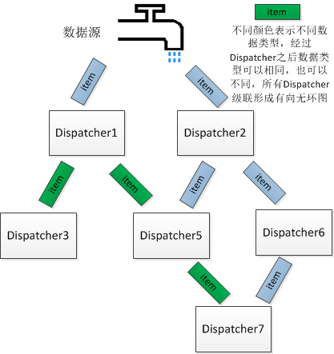

Dispatcher
---
1.初衷
--
golang天生是为了解决并发问题，它的诞生使得人们更容易解决并发问题，并且极大了降低了编程门槛，提高了编程效率。但是对于初学者还是很难很好的进行并发编程。
为了更好的、更高效的编程，使得开发人员能够更多的关注于业务逻辑的开发，才有了该项目的想法。

2.设计思路
--
本项目适用于流式处理的场景，由一个统一的入口dispatcher做分发工作，可以任意级联，形成用户拓扑图，来完成不同的任务，配合消息队列，很容易实现简单的storm流式处理项目。



<center>(示例图)</center>

3.使用
--
使用者可以继承自DefaultDispatcher，或者实现自己的Dispatcher接口，不过强烈建议继承自DefaultDispatcher，然后根据需要自定义处理拓扑。主要的业务逻辑可以在SetPreFunc和SetSufFuc中实现。
配置文件必须为每个Dispatcher提供三个参数，例如：

    name        = framework
    concurrency = 3
    msgMaxSize  = 2

    [parse_dispatcher]
    name        = parse_dispatcher
    concurrency = 3
    msgMaxSize  = 2
```go
import (
    "github.com/guyannanfei25/flowprocess"
)

// 主入口可以直接使用默认
var framework flowprocess.DefaultDispatcher

    framework.Init(ini, "")

    // 定义用户的业务Dispatcher，将DefaultDispatcher组合进即可
    type ParseDispatcher struct {
        flowprocess.DefaultDispatcher
    }

    parse  := new(ParseDispatcher)
    parse.Init(ini, "parse_dispatcher")

    // 设置用户业务处理函数
    parse.SetPreFunc(parseline)

    // 将不同业务级联，形成拓扑
    framework.DownRegister(parse)

    framework.Start()

    framework.Close()
```

logProcess例子展示简单的日志处理流程。

4.注意事项
---
如果涉及到多协程安全的问题，需要使用者自己保证。该项目适用场景为流式处理，每个dispatcher分析对应的item，递交给下游。横向级联的业务最好是独立的，且不应该去修改item，因为所有同级别Dispatcher都会分析item，且顺序不固定。

5.适用场景
---
比如日志分析场景：item是一条日志，该日志需要根据不同的需求进行分析，因此横向级联的时候就可以定制不同需求的dispatcher，大家独立分析。之后第一层级的dispatcher可以生成分析结果，发送给后续的dispatcher。

6.TODO
---
定制初始化和结束的方法有两种:

1, 增加DefaultDispatcher成员变量，为其增加两个函数变量，修改DefaultDispatcher，初始化和结束方法；

2, 覆盖DefaultDispatcher的初始化和结束方法，在自定义初始化结束方法之中去调用。

方法1，可以灵活的控制自定义方法的执行顺序，但是对代码有侵入性

方法2，对原始代码无侵入性，无法随意控制插入代码顺序
